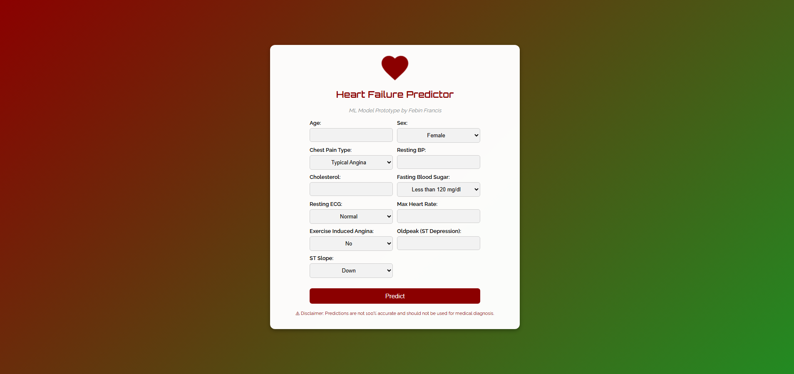

# ❤️ Heart Failure Predictor

🚀 A Machine Learning-based web application to predict the risk of heart failure based on medical data.



## 🌟 About the Project

This project uses **Random Forest Classifier** to predict heart failure risk. The app is deployed on **Render** and accessible at:  
🔗 [Heart Failure Predictor](https://heart-failure-predictor-wrnv.onrender.com)

**Dataset Source**: [Heart Failure Prediction Dataset](https://www.kaggle.com/datasets/fedesoriano/heart-failure-prediction)

### 🔮 Future Plans
I plan to implement more models like **Logistic Regression** and **Neural Networks** to improve accuracy and performance.

## ⚙ Features

✅ User-friendly web interface  
✅ Input medical parameters for prediction  
✅ Machine Learning-powered predictions  
✅ Secure deployment on Render  

## 🛠️ Technologies Used

- **Python**
- **Flask**
- **Scikit-learn**
- **Pandas & NumPy**
- **Render (for deployment)**  
- **HTML, CSS (for UI)**

## 🚀 Getting Started

### 🔧 Installation

Clone the repository and install dependencies:

```bash
git clone https://github.com/francisfebin/HeartFailure_App.git
cd HeartFailure_App
pip install -r requirements.txt
```

### ▶️ Running Locally

```bash
python app.py
```

## 🤝 Acknowledgments

Special thanks to these amazing resources that helped me in building this project:

- ChatGPT  
- Deepseek  
- [Machine Learning Flask Deployment Tutorial](https://www.youtube.com/watch?v=I4Xg2cdvGzU&list=PLuJMPyH4NjJM2icpdAcjDRmDGi8I_X7rE&index=3)  
- [Heart Disease Prediction Video](https://youtu.be/WuEGXlokpuQ?si=Dp8Hf7aUD82XNTz6)

## 📜 License

This project is licensed under the **MIT License**.

---

💡 *Contributions and suggestions are always welcome!* 🎉
